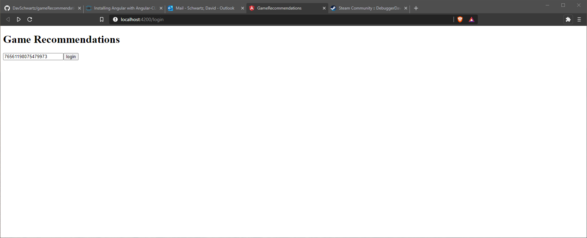
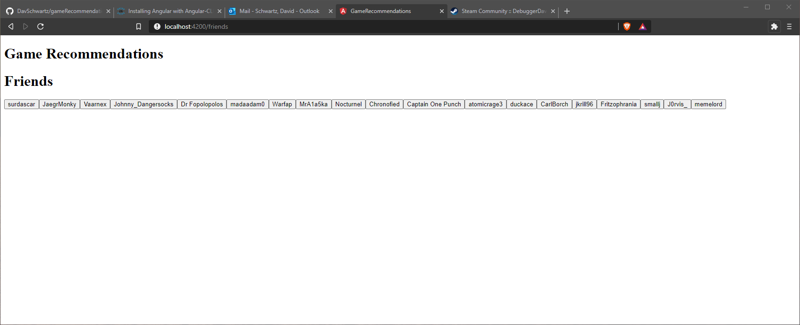
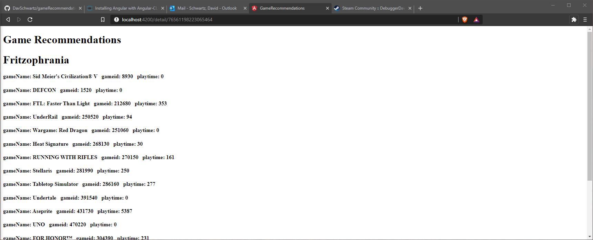

# GameRecommendations

Angular app to compare games between Steam users using the Steam Web API

# How to run
add a steam web api key to the file gameRecommendations/server/steamKey.js

install node.js  
open Command Prompt  
install angular: `npm install -g @angular/cli`  
cd to gameRecommendations folder  
start app `ng serve --open`  

open another Command Prompt  
cd to gameRecommendations\server  
start server: `node server`  

enter your steam id and login  
(a steam user id can be found in the URL of a browser when on a steam user's home page)  

if it doesn't work, there might be an issue with cors 'Access-Control-Allow-Origin'  

